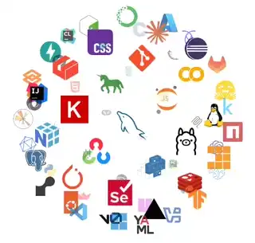

  

<h2 align="center">👋 Hi there, I'm Pranesh</h2>

  🎓 B.Tech AI & ML | 🧠 AI + Web Developer | 🌐 Erode, India

---

### 🚀 About Me

I'm a passionate Final year B.Tech student specializing in **Artificial Intelligence and Machine Learning** at **Bannari Amman Institute of Technology**.  
I enjoy building intelligent systems, AI agents, and cloud-based applications.  
I’m proficient in **Python, C, Java, SQL**, and deeply interested in **LLMs, Generative AI, AI Agents, and Software Development**.

---

### 🧠 My Skills

  

---

### 💼 Projects

- 🔥 **GPT-2 Tanglish Chatbot:** Built a WhatsApp-like conversational bot using GPT-2 with QLoRA (4-bit quantization) for efficient training on RTX 3050 (6GB). Enhanced with TF-IDF + Cosine Similarity for better contextual understanding.  
- 😊 **Emotion Detection using BERT:** Developed an NLP model using BERT for accurate sentiment analysis with deployment-ready interfaces using Gradio.  
- 🤖 **Telegram Chatbot:** Engineered a chat-mimicking Telegram bot trained on user chat logs, deployed on Railway with cloud scaling.  

---

### 🎯 Areas of Interest

- Artificial Intelligence  
- Machine Learning  
- Generative AI & LLMs  
- AI Agents & Automation  
- Software Development  
- Cloud Computing  
- Vector Databases (ChromaDB)  
- Database Design & Management  

---

### 🐍 GitHub Snake

  

---

### 📊 GitHub Stats

  
  

---

### 🔥 Contribution Streak

  
  

---

### 👁 Profile Views 

  

---

### 🔗 Connect with Me

  
  
  

---

  💻 I’m always open to collaborating on exciting AI, ML, or cloud-based projects. Let's build something amazing together!

