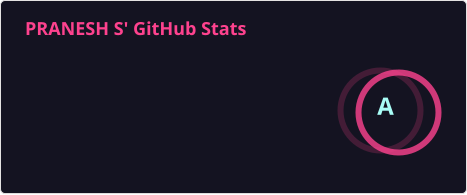
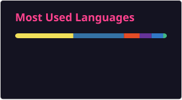
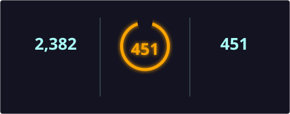

  
  

<h2 align="center">👋 Hi there, I'm Pranesh</h2>

  🎓 B.Tech AI & ML Graduate | 🧠 AI & Web Developer | 🌐 Erode, India

---

### 🚀 About Me

I’m a **B.Tech graduate** in **Artificial Intelligence and Machine Learning** from **Bannari Amman Institute of Technology**.  
Passionate about **Machine Learning, NLP, Deep Learning, and Cloud Computing**, I enjoy building **AI-powered applications**, **automation tools**, and **cloud-integrated systems**.  
I’m proficient in **C, Java, Python (Basics), SQL**, and have hands-on experience with **AI Agents, LLMs, Vision Models, and Cloud Technologies**.

---

### 🧠 My Skills

<h3>
  

  <b>Programming Language</b>

  
</h3>

<h3>
  

  <b> Full Stack</b>

  
</h3>

<h3>
  

  <b>ML,DS&DL</b>

  
</h3>

<h3>
  

  <b>LLM, GenAI & AI Agents</b>

  
</h3>

<h3>
  

  <b>Cloud & Deployment</b>

  
</h3>

<h3>
  

  <b>IDE, Package Manager & Version Control</b>

  
</h3>

---

### 🧑💻 Experience

**AI Engineering Intern — Wipro Connected Services** *(formerly Harman DTS)* · Feb 2026 – Jun 2026

- Achieved **82% executable-SQL generation (37/45)** on the **Spider benchmark** by building an **NL2SQL2NL** system on the **Model Context Protocol (MCP)** with schema-aware prompting, enabling context-aware, multi-turn plain-English querying of relational databases for business users.  
- Reduced SQL composition time by **40%** and passed **100% of an 8-query business demo suite** by delivering the pipeline to non-technical stakeholders with conversational, **Matplotlib-based chart generation**.  
- Deployed team-built agents and MCP servers to **AWS Bedrock AgentCore Runtime** by containerizing FastAPI services as **linux/arm64 Docker** images against the AgentCore service contract and publishing to **Amazon ECR**, covering both HTTP and MCP runtime protocols.  
- Achieved **92% tool–agent alignment accuracy** and **35% faster agent development** by building a **Multi-Agent Workflow Optimizer** with ontology-driven requirement parsing and AgentBank validation, preventing 5+ duplicate tool implementations.  

---

### 💼 Projects

- 🔁 **turnloop – Agentic Coding Harness** *(Python, Textual, vLLM, Modal, PyPI)* — [github.com/Pranesh-2005/turnloop](https://github.com/Pranesh-2005/turnloop)  
  Cut agent input-token usage by **20%** and tool-call error rate to **0%** by building an evaluation harness and running a **7-arm, 84-run ablation** on agentic-harness design; disabling context compaction cost 39% more input tokens (273K vs 196K median). Shipped to **PyPI** — 21,300 lines of Python, 383 tests, only 5 runtime dependencies, no vendor SDKs — and self-hosted the 744B-parameter **GLM-5.2 MoE** evaluation target on **vLLM** across 4x H200 GPUs via **Modal**.  
- ☁️ **CloudLens – Multi-Agent AWS Operations Platform** *(LangGraph, FastAPI, A2A)* — [github.com/Pranesh-2005/Cloudlens](https://github.com/Pranesh-2005/Cloudlens)  
  Built a **LangGraph supervisor** routing to **6 specialist agents** for cost, forecasting, security, and deployment across tenant AWS accounts, exposed through both an **A2A** protocol server and a **FastMCP** endpoint, with **Fernet-encrypted credentials** and human approval gating on every mutating action.  
- 🔍 **RagObserve – RAG Observability Platform** *(Python, FastAPI, SQLite, PyPI)* — [github.com/Pranesh-2005/RagObserve](https://github.com/Pranesh-2005/RagObserve)  
  Cut tracing overhead **136x** (379.8 ms → 2.8 ms per trace) by moving the SQLite writer to **WAL journaling**, making the tracer safe on an application's hot path; covers **11 LLM providers** with LangChain and LlamaIndex adapters, fully offline.  
- 🧠 **LLM Chatbot with Long-Term RAG Memory** *(Qwen2.5-7B, LoRA, Unsloth, Modal, GGUF)*  
  Fine-tuned **Qwen2.5-7B-Instruct** with **LoRA (Unsloth)** on serverless **Modal A10G** GPUs using **14K instruction-tuning samples** engineered from 120K+ raw chat messages; added long-term memory via RAG retrieval over **30K+ embedded bursts** and exported **4-bit GGUF** models for local inference.  

---

### 📜 Certifications

- **Anthropic:** Introduction to Model Context Protocol; Model Context Protocol: Advanced Topics  
- **Microsoft:** Azure AI Fundamentals (AI-901)  
- **freeCodeCamp:** Machine Learning with Python  

---

### 🏆 Achievements & Open Source

- ⭐ **github-readme-stats-fast** — GitHub profile stats generator with a companion **GitHub Action**: **270+ stars, 59 forks**.  
- 📦 **PyPI packages** — `turnloop` (agentic coding CLI), `guardix` (prompt-injection guard), `Text-Emotion`, `DocTok`.  
- 🤗 **35+ AI demos** built and deployed on **Hugging Face**, spanning RAG, agents, and model-internals visualizers (GPT-2, ViT, YOLO).  

---

### 🎯 Areas of Interest

- Artificial Intelligence & Machine Learning  
- Generative AI & LLMs  
- AI Agents & Automation  
- Cloud Computing (Azure) & Docker  
- Database Design & Vector Databases (ChromaDB)  
- Intelligent Automation  

---

### 🐍 GitHub Snake

  

---

### 📊 GitHub Stats

  
  

---

### 🔥 Contribution Streak

---

### ⏲ WakaTime Stats

---

### 👁 Profile Views

  

---

### ☕ Support Me

---

### 🔗 Connect with Me

  
  
  
  

---

  💻 Always open to collaborating on exciting **AI, ML, or Cloud-based projects**. Let’s innovate together!

